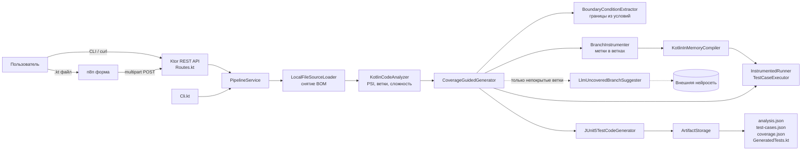

# Архитектура IntelligentTestAgent

Документ описывает фактический код ветки `wip/kotlin-only`. Каждое утверждение
сверено с исходниками; цифры взяты из реальных запусков (см. раздел
«Результаты измерений»). Если что-то не проверялось, это отмечено словами
«не проверено».

## 1. Назначение

IntelligentTestAgent принимает исходный код на **Kotlin** (файл `.kt` или
каталог) и генерирует для него **тесты на Kotlin/JUnit5**, в которых ожидаемые
значения получены реальным запуском кода, а не написаны вручную или
предложены нейросетью.

Что происходит с входным файлом:

1. Код разбирается, из него извлекаются функции, ветвления, циклы, исключения.
2. Из условий (`if (total >= 100.0)`, `when`, проверки строк) извлекаются
   значения, которые стоит проверить.
3. В копию кода вставляются метки в каждую ветку, копия компилируется в памяти.
4. Функции запускаются на подобранных входах, фиксируется, какие ветки
   выполнились. Остаются только те входы, которые добавляют покрытие.
5. Для каждого оставшегося входа фиксируется реальный результат (значение или
   исключение) и записывается как `assertEquals` или `assertThrows`.
6. Если после этого остались непокрытые ветки и настроена нейросеть, ей
   отправляются только эти ветки. Её значения принимаются, если при запуске
   они реально увеличивают покрытие.

## 2. Поток данных



То же в текстовом виде:

```
.kt файл
  -> LocalFileSourceLoader          читает файл, убирает BOM
  -> KotlinCodeAnalyzer             PSI, функции, ветки, сложность, пропуски
  -> CoverageGuidedGenerator
       BoundaryConditionExtractor   значения из условий
       BranchInstrumenter           копия кода с метками веток
       KotlinInMemoryCompiler       компиляция копии в памяти
       InstrumentedRunner           запуск кандидатов, сбор покрытия
       поиск мутациями              для веток, которые не нашлись
       LlmUncoveredBranchSuggester  (необязательно) значения для остатка
  -> JUnit5TestCodeGenerator        тесты с реальными assert
  -> ArtifactStorage                файлы результата
```

Точка входа для обоих режимов одна: `PipelineService.generateTests`. CLI
(`Cli.kt`) и REST (`Routes.kt`) вызывают именно его.

## 3. Кто за что отвечает

В колонке «Кто реализовал» строго одно из трёх: **НАШ АЛГОРИТМ** (код,
написанный нами), **БИБЛИОТЕКА** (готовая сторонняя, с названием),
**ВНЕШНЯЯ НЕЙРОСЕТЬ**.

| Компонент | Ответственность | Кто реализовал |
|---|---|---|
| `LocalFileSourceLoader` (`source/SourceLoader.kt`) | Чтение `.kt` из файла или каталога, пропуск `.git`, `build`, `target`, `out`, `.gradle`, снятие BOM | НАШ АЛГОРИТМ |
| `GitSourceLoader` | `git clone --depth 1` во временный каталог, затем чтение файлов. **В конвейер не подключён**, из `PipelineService` не вызывается | НАШ АЛГОРИТМ |
| Парсер Kotlin (PSI) | Построение дерева исходного кода (`KtFile`, `KtIfExpression` и т.д.) | БИБЛИОТЕКА (`kotlin-compiler-embeddable` 2.0.21) |
| `KotlinPsi`, `KotlinCodeAnalyzer` | Запуск парсера, поиск синтаксических ошибок, извлечение функций, параметров, ветвлений, циклов, исключений, подсчёт сложности, определение пропускаемых функций | НАШ АЛГОРИТМ |
| `BoundaryConditionExtractor` | Извлечение значений из условий, разворачивание констант | НАШ АЛГОРИТМ |
| `BranchInstrumenter` | Вставка меток в ветки текстовыми правками по смещениям PSI | НАШ АЛГОРИТМ |
| Компилятор Kotlin (`K2JVMCompiler`) | Превращение исходников в классы | БИБЛИОТЕКА (`kotlin-compiler-embeddable`) |
| `KotlinInMemoryCompiler` | Запись исходников во временный каталог, вызов компилятора, загрузка классов | НАШ АЛГОРИТМ |
| `TestCaseExecutor`, `TypeConversion` | Приведение строковых значений к типам, вызов функции через рефлексию, фиксация результата или исключения, таймаут | НАШ АЛГОРИТМ |
| `InstrumentedRunner`, `ProbeSession` | Запуск кандидата на размеченной копии, чтение посещённых веток | НАШ АЛГОРИТМ |
| `HeuristicScenarioGenerator` | Базовый набор кандидатов по типам параметров | НАШ АЛГОРИТМ |
| `CoverageGuidedGenerator` | Пул кандидатов, поиск мутациями, жадный отбор по приросту покрытия, итоговые тест-кейсы и отчёт | НАШ АЛГОРИТМ |
| `SuiteCoverageMeter` | Независимый пересчёт покрытия итогового набора | НАШ АЛГОРИТМ |
| `TestCasePostProcessor` | Удаление дубликатов, нормализация пробелов | НАШ АЛГОРИТМ |
| `JUnit5TestCodeGenerator` | Выбор вида проверки, литералы значений, вызов для member, object, top-level | НАШ АЛГОРИТМ |
| KotlinPoet | Построение текста Kotlin-файла (`FileSpec`, `FunSpec`) | БИБЛИОТЕКА (KotlinPoet 1.16.0) |
| `LlmUncoveredBranchSuggester`, `LlmSuggestionParser`, `PromptTemplates` | Формирование запроса по непокрытым веткам, разбор JSON-ответа, проверка значений | НАШ АЛГОРИТМ |
| Значения для непокрытых веток | Предложение входов, которых не нашёл наш поиск | ВНЕШНЯЯ НЕЙРОСЕТЬ |
| `OpenAiCompatibleLlmClient` | Формирование и разбор запроса к `/chat/completions`, перевод любой ошибки в `Failure` | НАШ АЛГОРИТМ |
| HTTP-клиент | Сетевой вызов | БИБЛИОТЕКА (OkHttp 4.12.0) |
| `ArtifactStorage` | Запись `analysis.json`, `test-cases.json`, `coverage.json`, `GeneratedTests.kt` | НАШ АЛГОРИТМ |
| Сериализация JSON | Запись и чтение JSON | БИБЛИОТЕКА (Jackson 2.15.3) |
| `Routes`, `Server`, `Dto`, `PipelineService`, `Cli` | Маршруты, DTO, сборка конвейера, командная строка | НАШ АЛГОРИТМ |
| HTTP-сервер | Приём запросов, multipart | БИБЛИОТЕКА (Ktor 2.3.6, Netty) |
| Форма загрузки и вызов API | Веб-форма и HTTP-запрос по `integration/n8n/workflow.json` | БИБЛИОТЕКА (n8n, готовый low-code продукт) |
| Запуск сгенерированных тестов | Выполнение `GeneratedTests.kt` в проекте пользователя | БИБЛИОТЕКА (JUnit 5) |

## 4. Собственные алгоритмы

### 4.1 Загрузка и BOM

`LocalFileSourceLoader.load` принимает путь. Для файла берёт его, если
расширение `kt`, для каталога обходит его рекурсивно (`walkTopDown`),
пропуская каталоги `.git`, `build`, `target`, `out`, `.gradle`. Из текста
удаляется символ `U+FEFF` (BOM). `KotlinCodeAnalyzer.analyzeDetailed` удаляет
его повторно, потому что анализатор используется и в обход загрузчика
(эндпоинт загрузки, тесты).

### 4.2 Разбор и метрики (`KotlinCodeAnalyzer`)

`analyzeDetailed` для каждого файла вызывает `KotlinPsi.parse`, затем ищет
`PsiErrorElement`. Если найден, файл исключается из анализа, а в `warnings`
добавляется сообщение с именем файла, номером строки и описанием первой
ошибки. Остальные файлы обрабатываются.

Для здоровых файлов `collect` обходит верхний уровень: функции верхнего
уровня, классы, `object`, `companion object`. Каждой функции присваивается
`kind`: `member`, `top-level`, `object-member`, `companion-member`.

`analyzeFunction` собирает:

- параметры: имя, тип без `kotlin.` и `?`, признак `nullable`, признак
  значения по умолчанию;
- ветвления: `if`, элементы `when`, `elvis`;
- циклы: `for`, `while`, `do-while`;
- исключения: `throw` (тип берётся из вызова конструктора) и `catch`.

**Цикломатическая сложность** считается как

```
1 + число if + число элементов when (кроме else) + число ?: + число && и ||
  + число for + число while + число do-while + число catch
```

Проверка: у `OrderProcessor.calculateDiscount` шесть `if`, значит сложность 7.
Это совпадает со значением `cyclomaticComplexity` в реальном `analysis.json`.

`skipReason` определяет, какие функции не тестируются. Причины (из кода):
`interface`, `enum class`, `annotation class`, `inner class`,
`abstract or sealed class`, `private class`, `class requires constructor
arguments`, `private object`, `nested class`, `function has no body`,
`suspend function`, `extension function`, `generic function`,
`private function`, `protected function`, `internal function`,
`vararg parameter`, `entry point` (функция `main`) и
`unsupported parameter type: <тип>`.

### 4.3 Границы из условий (`BoundaryConditionExtractor.extract`)

Для функции строится карта «параметр → интересные значения» и список
числовых констант. Что распознаётся:

- сравнения `<`, `<=`, `>`, `>=`, `==`, `!=`, `===`, `!==` между выражением и
  константой; константа вычисляется `ConstantEvaluator` (литералы, унарный
  минус, `+ - * / %` над числами, склейка строк, `const val`, свойства
  `companion object`, свойства верхнего уровня, локальные `val`). Поэтому
  условие `total >= MEMBER_DISCOUNT_THRESHOLD * 2` даёт границу 200.0;
- для целых значения `граница-1`, `граница`, `граница+1`, для дробных сама
  граница, `граница±0.01` и `граница±1`;
- если в сравнении участвует не параметр, а локальная переменная
  (`val total = price * quantity`), значения приписываются параметрам, от
  которых она зависит (`dependencies`). Символьного решателя нет, поэтому
  значения для `total` подбираются не арифметикой, а поиском (п. 4.6);
- сравнение с `null`;
- `String`: `== "литерал"`, `equals`, `startsWith`, `endsWith`, `contains`,
  `isEmpty`, `isNotEmpty`, `isBlank`, `isNotBlank`, `length` рядом с
  константой;
- предикаты символов `isDigit`, `isLetter`, `isLetterOrDigit`, `isUpperCase`,
  `isLowerCase`, `isWhitespace` для строк (в том числе через переменную
  цикла): подставляются строки вроде `"1"`, `"a1"`, `"a"`;
- `when` по параметру: значения из условий, диапазоны `in a..b`.

### 4.4 Метки в ветках (`BranchInstrumenter.instrument`)

Инструментирование делается **текстовыми вставками по смещениям PSI**, без
перестройки дерева. Правки применяются в порядке убывания смещения, чтобы не
сдвигать ещё не применённые.

Помечаются:

- `then` и `else` каждого `if`. Если `else` нет, вставляется
  `else { hit(N) }`;
- тело каждого цикла (`for`, `while`, `do-while`). Считается вход в тело, а
  не «цикл пропущен»;
- каждый элемент `when`, включая `else`;
- тело каждого `catch`.

Не помечаются: `?:`, `&&` и `||`, тело `try`, лямбды отдельно.

Метка это вызов `agentcov.AgentCoverageProbe.hit(N)`. Класс метки
генерируется как ещё один файл (`probeSource`), состояние хранится в
`ThreadLocal`. Идентификатор ветки имеет вид `Класс.функция#N:вид`
(`OrderProcessor.calculateDiscount#1:if-then`). Ветка, у которой блок без
фигурной скобки, помечается как не инструментируемая. Размеченная копия
используется только для измерения; итоговые тесты обращаются к оригиналу.

### 4.5 Компиляция и запуск

`KotlinInMemoryCompiler.compile` записывает исходники во временный каталог,
вызывает `K2JVMCompiler` с `-no-stdlib -no-reflect -jvm-target 17` и
classpath из `kotlin-stdlib` работающей JVM, загружает результат через
`URLClassLoader`. Вызовы компилятора сериализованы блокировкой. Любая ошибка
компиляции превращается в `CompilationResult.Failure`.

`InstrumentedRunner.create` размечает код, компилирует и возвращает либо
`Ready`, либо `Unavailable(причина)`. `run` выполняет один тест-кейс в
отдельном потоке с таймаутом (3 секунды на кандидата для замера покрытия) и
возвращает результат и набор посещённых веток. При таймауте выставляется флаг
отмены, следующий вызов метки бросает `IllegalStateException`.

### 4.6 Отбор тестов по покрытию (`CoverageGuidedGenerator`)

`generate` возвращает `CoverageGenerationResult`. Внутри
`generateForFunction` выполняет для каждой тестируемой функции:

1. **Пул кандидатов** (`buildPool`, не более 200): «типичный» вектор
   значений; для булевых параметров все комбинации (до четырёх параметров);
   вариация одного параметра значениями из `domain` (типичное значение,
   значения экстрактора, `0`, `-1`, пустая строка, `null` для nullable);
   кандидаты `HeuristicScenarioGenerator`; ограниченное декартово
   произведение, если оно помещается в лимит, иначе случайная выборка.
2. **Замер.** Каждый кандидат выполняется на размеченной копии, фиксируется
   набор веток и результат.
3. **Жадный отбор.** Из уже выполненных кандидатов повторно выбирается тот,
   который добавляет больше всего новых веток, пока прирост не закончится.
4. **Поиск мутациями** (`mutate`) для веток, которые всё ещё не покрыты.
   Родитель берётся из отобранных (в 60% случаев) или из всех выполненных;
   меняется один параметр (иногда два). Для чисел операции: `×2`, `÷2`,
   `×10`, `÷10`, `±1`, подстановка константы из условий, константа делённая
   на другой числовой параметр, константа умноженная на другой числовой
   параметр. Последние две операции нужны для условий на производных
   величинах вроде `total = price * quantity`. Для строк: значение из
   подсказок, добавление и удаление символа, символ из небольшого алфавита,
   пустая строка. Лимиты `CoverageGeneratorConfig`: 150 попыток, 8 секунд на
   функцию, `seed = 42`. Так как есть лимит по времени, на медленной машине
   результат поиска может отличаться.
5. **Шаг с нейросетью** (см. раздел 5), только если остались непокрытые
   ветки.
6. **Представители исходов.** Дополнительно оставляется по одному кандидату на
   каждый вид исхода (`threw:<исключение>`, значение, `true`, `false`).
7. **Граничные кандидаты.** До 10 кандидатов, в которых меняется ровно один
   параметр и значение взято из подсказок или эвристики; берутся по кругу по
   параметрам.
8. **Тест-кейсы.** Для каждого оставшегося кандидата создаётся `TestCase`.
   Тип: исключение даёт `NEGATIVE`; значение из подсказок или крайнее
   значение (`Int.MAX_VALUE`, `0`, `-1`, строка длиной от 1000) даёт
   `BOUNDARY`; остальное `POSITIVE`. Описание строится по покрытым веткам:
   «Покрывает ветку if (quantity <= 0): вход …».

Отчёт по функции делит ветки на `covered`, `notFoundWithinBudget` и
`notInstrumentable`. Итоговые кейсы проходят `TestCasePostProcessor`
(ключ дубликата: класс, функция, сигнатура, тип, входные данные).

Если инструментированная копия не компилируется, `fallback` использует
эвристические кандидаты, выполняет их без меток (`executePlain`), не считает
покрытие и добавляет предупреждение «Покрытие ветвей не измерено: причина».

### 4.7 Пересчёт покрытия итогового набора (`SuiteCoverageMeter`)

`measure` заново выполняет **каждый итоговый тест-кейс** на размеченной копии
и объединяет посещённые ветки. Это защита от завышения: покрытие пула
кандидатов и покрытие итогового набора после отбора и дедупликации могли бы
разойтись. Используется в тестах проекта (`CoverageGuidedGeneratorTest`).
В боевом конвейере (`PipelineService`) не вызывается: там берётся покрытие,
собранное самим генератором.

### 4.8 Фиксация результата (`TestCaseExecutor`)

`execute` приводит строки к типам (`TypeConversion`), находит функцию через
рефлексию и вызывает её в отдельном потоке с таймаутом (по умолчанию 10
секунд; при замере покрытия 3 секунды). Способ вызова зависит от `kind`:

- `top-level`: статический метод класса `ИмяФайлаKt`;
- `object-member`: через поле `INSTANCE`;
- `companion-member`: через поле `Companion`;
- `member`: создание экземпляра конструктором без аргументов.

Результат один из трёх: `ReturnedValue`, `ThrewException(класс)`,
`CouldNotExecute(причина)`. `Error` внутри вызванной функции и любой сбой
рефлексии превращаются в `CouldNotExecute`, запрос не падает.

Это и есть **golden master**: ожидаемое значение в тесте это то, что код
вернул при запуске, а не то, что должно быть по смыслу.

### 4.9 Типы (`TypeConversion`)

Поддерживаются `Int`, `Long`, `Short`, `Byte`, `Double`, `Float`, `Boolean`,
`Char`, `String` и их nullable-варианты. `null` допускается только для
nullable-параметров. Любой другой тип делает функцию непроверяемой
(`unsupported parameter type`).

### 4.10 Генерация текста тестов (`JUnit5TestCodeGenerator`)

Через KotlinPoet строится один файл `GeneratedTests.kt` в пакете
анализируемого кода. Для каждого класса создаётся тестовый класс
`<Класс>Test` (для top-level функций `<Файл>KtTest`). Имя метода:
`test_<функция>_<тип>_<номер>`. По результату запуска:

- `ReturnedValue`: `Assertions.assertEquals(ожидаемое, вызов)`; для `Unit`
  вызов без проверки;
- `ThrewException`: `Assertions.assertThrows(Класс::class.java) { вызов }`;
- `CouldNotExecute` или значение, для которого нет литерала: комментарии и
  `// TODO: assert expected = …`.

Литералы делаются безопасными: `Int.MIN_VALUE`, `Double.MAX_VALUE`, `Long` с
суффиксом `L`, `Float` с `f`, длинные повторяющиеся строки как
`"a".repeat(n)`.

## 5. Что делает нейросеть, а что нет

**Нейросеть вызывается в одном месте.** `CoverageGuidedGenerator` после
жадного отбора и поиска мутациями проверяет, остались ли непокрытые ветки.
Если остались и есть `LlmUncoveredBranchSuggester`, он отправляет модели
сигнатуру функции и список непокрытых веток с текстом условий и просит
JSON-массив значений параметров.

Как это устроено:

- `PipelineService` всегда создаёт `LlmUncoveredBranchSuggester` с клиентом
  `OpenAiCompatibleLlmClient` (`LlmConfig.fromEnv`). Но клиент вызывается
  только если непокрытые ветки есть. **Если наше ядро покрыло всё (как на
  всех трёх примерах проекта), к нейросети не обращаются вообще, даже при
  корректном ключе.**
- Без `LLM_API_KEY` клиент возвращает `Failure` без сетевого вызова. Ошибка
  HTTP (в том числе 403 и 429), сбой сети, пустой или нечитаемый ответ также
  дают `Failure`. Тогда шаг молча пропускается, результат целиком получен
  нашим ядром.
- Ответ разбирается `LlmSuggestionParser`: убираются ограждения ` ``` `,
  берётся первый JSON-массив или объект, у каждого элемента должны быть **все**
  параметры функции, каждое значение проходит `TypeConversion`. Невалидное
  отбрасывается.
- Каждое предложенное значение **выполняется** на размеченной копии.
  Принимается только то, что добавляет непокрытую ветку. Такой тест-кейс
  получает `id` вида `функция-llm-N` и описание «Предложено LLM, покрывает
  ветку …».
- Ожидаемые значения в `assertEquals` и `assertThrows` для таких кейсов
  тоже берутся из запуска, а не из ответа модели.

Чего нейросеть не делает: не анализирует код, не выбирает значения при
нормальной работе, не пишет `assert`, не определяет ожидаемые результаты, не
влияет на покрытие, которое мы измеряем сами.

**Честная оговорка о проверке.** Гибридный режим вживую **не проверялся**.
Ключ из `.env` на момент проверок возвращал HTTP 403 от провайдера, поэтому
логика принятия значений проверена только модульными тестами с подменой
`LlmClient`. Прежний `LlmScenarioEnricher` (свободный текст с заглушками
вместо значений) удалён.

## 6. Артефакты

Результат лежит в каталоге вывода:

```
<outputDir>/analysis.json
<outputDir>/test-cases.json
<outputDir>/coverage.json
<outputDir>/generated-tests/<путь по пакету>/GeneratedTests.kt
```

Для файла без `package` тесты лежат прямо в `generated-tests/GeneratedTests.kt`.
Примеры ниже получены запуском CLI на `src/test/resources/OrderProcessor.kt`
без ключа нейросети (фрагменты сокращены многоточием).

### analysis.json

```json
{
  "sourcePath" : "…\\OrderProcessor.kt",
  "language" : "kotlin",
  "functions" : [ {
    "name" : "calculateDiscount",
    "className" : "OrderProcessor",
    "parameters" : [
      { "name" : "price", "type" : "Double", "nullable" : false, "hasDefault" : false },
      { "name" : "quantity", "type" : "Int", "nullable" : false, "hasDefault" : false },
      { "name" : "isMember", "type" : "Boolean", "nullable" : false, "hasDefault" : false } ],
    "returnType" : "Double",
    "branches" : [ { "kind" : "if", "condition" : "quantity <= 0", "lineNumber" : 9 }, … ],
    "cyclomaticComplexity" : 7,
    "kind" : "member",
    …
```

### test-cases.json

```json
{
  "id" : "calculateDiscount-1",
  "functionName" : "calculateDiscount",
  "className" : "OrderProcessor",
  "type" : "BOUNDARY",
  "description" : "Покрывает ветку else of if (quantity <= 0); else of if (price < 0): вход price=100.0, quantity=1, isMember=true",
  "inputData" : { "price" : "100.0", "quantity" : "1", "isMember" : "true" },
  "expectedResult" : "Возвращается значение 15.0",
  "steps" : [ "Подготовить входные данные: price=100.0, quantity=1, isMember=true",
              "Вызвать OrderProcessor.calculateDiscount",
              "Проверить результат: Возвращается значение 15.0" ],
  "signature" : "Double,Int,Boolean"
}
```

Это описание для человека: что проверяется, с какими входами и что ожидается.

### coverage.json

```json
{
  "measured" : true,
  "totalBranches" : 41,
  "coveredBranches" : 41,
  "branchCoverage" : 1.0,
  "functions" : [ {
    "functionKey" : "OrderProcessor.calculateDiscount(Double,Int,Boolean)",
    "totalBranches" : 12,
    "coveredBranches" : 12,
    "covered" : [ { "id" : "OrderProcessor.calculateDiscount#1:if-then",
                    "label" : "if (quantity <= 0)" }, … ],
    "notFoundWithinBudget" : [ ],
    "notInstrumentable" : [ ],
    "executed" : true
  }, … ]
}
```

Если ветки нет в `covered`, она будет в `notFoundWithinBudget` (не нашли
значений за бюджет) или в `notInstrumentable` (метку поставить нельзя).

### GeneratedTests.kt

```kotlin
public class OrderProcessorTest {
  /**
   * Покрывает ветку else of if (quantity <= 0); else of if (price < 0): вход price=100.0,
   * quantity=1, isMember=true
   */
  @Test
  public fun test_calculateDiscount_boundary_1() {
    val instance = OrderProcessor()
    Assertions.assertEquals(15.0, instance.calculateDiscount(100.0, 1, true))
  }
  …
  @Test
  public fun test_calculateDiscount_negative_1() {
    val instance = OrderProcessor()
    Assertions.assertThrows(IllegalArgumentException::class.java) { instance.calculateDiscount(-1.0,
        1, true) }
  }
```

В реальном файле 643 строки, 68 проверок (из них 18 `assertThrows`), ни одного
`TODO`.

## 7. Ответ REST API

`POST /generate-tests` и `POST /generate-tests-upload` возвращают
`GenerateTestsResponse`:

| Поле | Смысл |
|---|---|
| `functionsCount` | Сколько функций найдено (включая пропущенные) |
| `testCasesCount` | Сколько тест-кейсов сгенерировано |
| `generatedTestFilePath` | Каталог с тестами; `null`, если каталог вывода не задан |
| `language` | Всегда `kotlin` |
| `executedTestCases` | Сколько кейсов реально выполнено (результат не `CouldNotExecute`) |
| `skippedFunctions` | Список `Класс.функция: причина` |
| `warnings` | Синтаксические ошибки, «покрытие не вычислялось», «покрытие не измерено» |
| `branchCoverage`, `coveredBranches`, `totalBranches` | Покрытие ветвей; `null`, если отчёта нет (например, при провале компиляции размеченной копии); при отсутствии ветвей `branchCoverage` тоже `null` |
| `coverageMeasured` | `true`, если покрытие реально измерено |

## 8. Где лежит результат

- Через n8n или `POST /generate-tests-upload` без `outputDir`: в контейнере
  `/data/output/<uuid>/`, на хосте `build/agent-output/<uuid>/`
  (`docker-compose.yml` монтирует `./build/agent-output` как `/data/output`).
- `POST /generate-tests` с `outputDir`: по указанному пути внутри контейнера.
- CLI (`.\run.ps1 generate`): в `build\agent-output` или в каталог из
  `-Output`, без подкаталога `<uuid>`, с перезаписью файлов.

## 9. Результаты измерений

Покрытие ветвей замерялось одной и той же инструментацией. «До» это только
прежние эвристики (`HeuristicScenarioGenerator`), «после» это ядро. Цифры по
`SampleStringUtils.kt` (с 6/7 до 7/7) получены после исправления, добавившего
поддержку предикатов символов (`isDigit` и др.); до него ядро тоже давало 6/7.

| Файл | До | После | Тест-кейсов у ядра |
|---|---|---|---|
| `OrderProcessor.kt` | 37/41 (90,2%) | 41/41 (100%) | 68 |
| `SampleCalculator.kt` | 6/7 | 7/7 | 14 |
| `SampleStringUtils.kt` | 6/7 | 7/7 | 10 |

Дополнительно:

- Сгенерированный набор для `OrderProcessor.kt` скомпилирован вместе с
  исходником в отдельном модуле и запущен: **68 из 68 тестов прошли**. Это
  проверялось при верификации этапа B на коммите `e6cceae`; на последнем
  коммите отдельно не повторялось.
- Состав 68 кейсов при последнем запуске: `BOUNDARY` 43, `NEGATIVE` 18,
  `POSITIVE` 7.
- Собственные тесты проекта: 93 теста, 0 падений (полный прогон Gradle).
- Docker-образ агента: 832 МБ. Время ответа на загрузку файла при холодном
  старте: `OrderProcessor.kt` 37 с, `SampleCalculator.kt` 9 с,
  `SampleStringUtils.kt` 7 с.

Как читать эти цифры:

- Прежняя эвристика уже давала около 90% на `OrderProcessor.kt`. Реальный
  прирост около 10 процентных пунктов, а не «с нуля до ста».
- Замер сделан на трёх небольших файлах. На реальных проектах результат
  может быть иным, обобщать нельзя.
- Метрика считает ветви (вход в `then`, `else`, тело цикла, элемент `when`,
  `catch`), а не условия внутри `&&` и `||` (не MC/DC).
- 100% покрытия ветвей не означает, что тесты хорошо проверяют поведение.

## 10. Ограничения

- **Golden master фиксирует текущее поведение, а не правильное.** Если в
  функции ошибка, тест закрепит её как норму. Пример из реального вывода:
  `Assertions.assertEquals(20.200000000000003, instance.calculateDiscount(1.0, 101, true))`.
  Значение 20.200000000000003 это артефакт плавающей запятой, тест сравнивает
  его без допуска. Такие проверки нужно просматривать человеку.
- **Типы параметров.** Поддерживаются только `Int`, `Long`, `Short`, `Byte`,
  `Double`, `Float`, `Boolean`, `Char`, `String` и их nullable-варианты.
  Функции с другими параметрами (списки, объекты, `enum`) пропускаются.
- **Что пропускается** и показывается в `skippedFunctions`: `suspend`,
  generic, extension, `private`, `protected`, `internal`, `vararg`, `main`,
  функции без тела, функции классов без конструктора без аргументов,
  абстрактные, sealed, вложенные, внутренние классы, интерфейсы, `enum`.
- **Ветки вне подмножества.** `?:`, `&&`, `||`, тело `try` и лямбды отдельно
  не размечаются.
- **Недостижимый код** останется в `notFoundWithinBudget`. Отличить его от
  «не нашли значения» автоматически нельзя.
- **Состояние и ввод-вывод.** Функции, зависящие от состояния объекта,
  файлов, сети, времени, не дают стабильных результатов; тест может
  закрепить случайное значение. Специальной защиты нет.
- **Таймаут.** Кандидат выполняется не более 3 секунд при замере покрытия
  (10 секунд в `TestCaseExecutor` по умолчанию). Зависший кандидат теряется.
- **Только Kotlin.** Файлы других языков не обрабатываются.
- **BOM и синтаксические ошибки.** BOM удаляется. Файл с синтаксической
  ошибкой не тестируется, в `warnings` указывается строка первой ошибки.
- **Вес и старт.** Образ 832 МБ из-за встроенного компилятора; первый запрос
  после старта заметно медленнее последующих.
